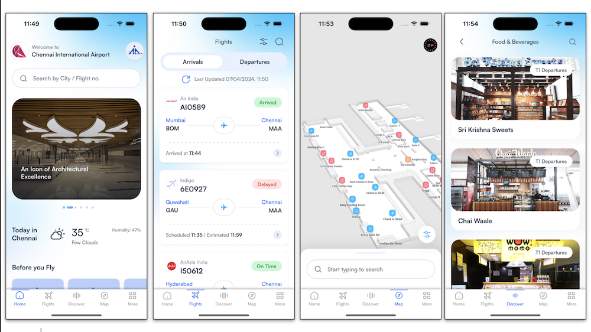

# iOS-developer-portfolio

## Chennai International Airport
[Chennai Airport](https://apps.apple.com/in/app/chennai-international-airport/id6447828652) Chennai International Airport is an officially iphone application for passangers, Application provides 3D-Airport Map, Indoor Navigation System, Live Parking Slot System etc.

The indoor navigation system was built using ibeacon,acclerometer,magnetometer,step detection,coremotion framework 

Developed in multi languages - English, Hindi, Tamil, French, Spanish, Chinese, Arabic

I was the sole mobile developer of the app.

##### 🔨Technologies: Swift, MVVM + Clean Architecture, GithHub, Mapbox SDK, Socket.io, Push Notifications, AWS SDK, REST API, COMBINE Framework for API Integrations using FUTURE publishers .
##### 🚀Platform: 📱iOS.

## Dubai Culture
[Dubai Culture](https://apps.apple.com/in/app/dubai-culture/id926793557) Dubai Culture is an officially iphone & ipad application for Dubai Culture government organisation Application provides 3D-musiums Map, Indoor Navigation System, Live audio information for places inside tourisam points.
    implemented augumented reality for increase visit experiance of tourist.

The indoor navigation system was built using ibeacon,acclerometer,magnetometer,step detection,coremotion framework,ARKit Framework

Developed in multi languages - English, Arabic

##### 🔨Technologies: Swift, MVVM + Clean Architecture, GithHub, Mapbox SDK, Socket.io, Push Notifications, AVFoundation framework for audio,ARKit
##### 🚀Platform: 📱iOS.

## Sharjah Airport
[Sharjah Airport](https://apps.apple.com/in/app/sharjah-airport/id1078903807) This is Sharjah Airport’s new app with real-time flight updates and status notifications, detailed maps of the terminal with indoor navigation, a boarding pass scanner, and more.

The indoor navigation system was built using ibeacon,acclerometer,magnetometer,step detection,coremotion framework,ARKit Framework

Developed in multi languages - English, Arabic

##### 🔨Technologies: Swift, MVVM + Clean Architecture, GithHub, Mapbox SDK, Socket.io, Push Notifications, AVFoundation framework for audio,ARKit
##### 🚀Platform: 📱iOS.

## Cochin Airport
[Cochin Airport](https://apps.apple.com/in/app/cochin-airport/id1459788346) This is Sharjah Airport’s new app with real-time flight updates and status notifications, detailed maps of the terminal with indoor navigation, a boarding pass scanner, and more.

The indoor navigation system was built using ibeacon,acclerometer,magnetometer,step detection,coremotion framework,ARKit Framework

Developed in multi languages - English, Malyalam

##### 🔨Technologies: Swift, MVVM + Clean Architecture, GithHub, Mapbox SDK, Socket.io, Push Notifications, AVFoundation framework for audio,ARKit
##### 🚀Platform: 📱iOS.

